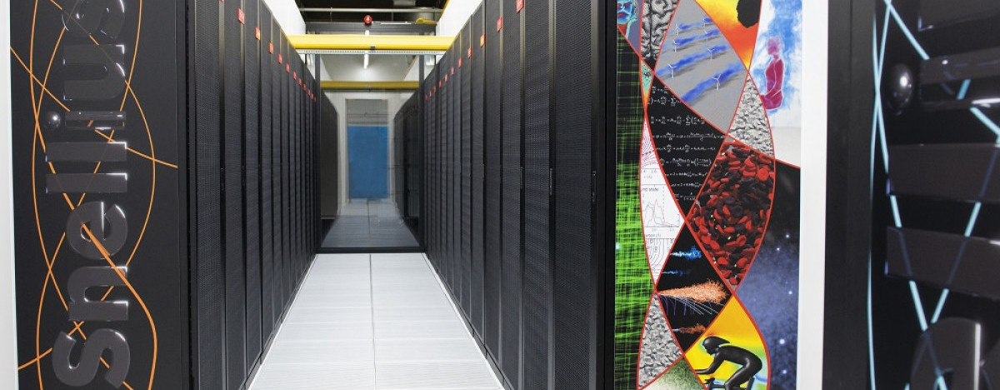

# snellius_101
Guide to run jobs and manage Linux terminal in Snellius: the National Supercomputer, the Netherlands

<table align="center" name="fig3">
    <tr align="center">
                    <td></td>
            </tr>
            <tr align="left">
                <td colspan="2"><b>Figure 1.</b> <a href="https://www.surf.nl/en/services/snellius-the-national-supercomputer">Snellius: the National Supercomputer</a></td>
    </tr>
</table>

## Basic Commands in Snellius

- Send files from Snellius -> Local: TERMINAL AT LOCAL
    ```
    rsync -av scur1216@snellius.surf.nl:~/atremote.txt "/Users/datoapanta/Desktop/"
    ```
- Send files from Local -> Snellius: TERMINAL AT LOCAL
    ```
    rsync -av "/Users/datoapanta/Downloads/kaggle.json" scur0402@snellius.surf.nl:/scratch-shared/scur0402_models
    ```

- To send job
    ```
    sbatch install_environment.job
    ```
- To check queue
    ```
    squeue
    ```
- Cancels and stops a job, independent of whether it is running or pending
    ```
    scancel JOBID
    ```

- Shows additional information of a specific job, like the estimated start time.
    ```
    scontrol show job JOBID 
    ```

- Get access to GPU from terminal
    ```
    srun --partition=gpu --gpus=1 --ntasks=1 --cpus-per-task=4 --time=03:00:00 --pty bash -i
    srun --partition=gpu_h100 --gpus=1 --ntasks=1 --cpus-per-task=18 --time=00:01:00 --pty bash -i
    ```

- To query job accounting information: ID, user, state of the job (running, completed, failed), start and end time, CPU usage, memory usage 
    ```
    sacct -j [jobid] --format=JobID,JobName,Partition,State,ExitCode
    ```

- To watch the queue every second
    ```
    watch -n 1 squeue
    ```

- To see how muchr emianign bidget we still have:
    ```
    accuse
    ```

- When you sbatch a job then this sends you an email when the job starts to run
    ```
    #SBATCH --mail-type=BEGIN,END,FAIL        # Notifications for job start, end, and fail
    #SBATCH --mail-user=your_email@gmail.com  # Your email address
    ```

- To test if jobs will break at the start
    ```
    ssh to gcn1
    ```

## Check NVIDIA GPU
- To check the GPU usage
    ```
    nvidia-smi
    ```

## Environments and Modules 
- To freeze requirements
    ```
    pip freeze > requirements.txt
    ```
- To remove newly install modules and install requirements,txt
    ```
    pip freeze > installed.txt 
    grep -vxF -f requirements.txt installed.txt | xargs pip uninstall -y
    ```

## To use rclone
1. Install rclone on your system by following the installation instructions for your operating system. You can find the installation guide at [rclone.org](https://rclone.org/docs/#installing).

2. Configure rclone by running the following command in your terminal:
    ```
    rclone config
    ```
    This will launch the configuration wizard, which will guide you through the process of setting up remote storage providers.

3. Follow the prompts in the configuration wizard to add a new remote storage provider. You will need to provide the necessary credentials and configure the desired settings for the remote storage.

4. Once you have configured a remote storage provider, you can use rclone to perform various operations such as copying files, syncing directories, and mounting remote storage as a local filesystem.

    Here are some examples of commonly used rclone commands:
    - Copy a file from local to remote storage:
      ```
      rclone copy /path/to/local/file remote:directory
      ```

    - Sync a local directory with a remote directory:
      ```
      rclone sync /path/to/local/directory remote:directory
      ```

    - Mount a remote storage as a local filesystem:
      ```
      rclone mount remote:directory /path/to/local/mountpoint
      ```

    - List files in a remote directory:
      ```
      rclone ls remote:directory
      ```

    - Delete a file from remote storage:
      ```
      rclone delete remote:file
      ```

    These are just a few examples of what you can do with rclone. For more information and a complete list of available commands, refer to the [rclone documentation](https://rclone.org/docs/).